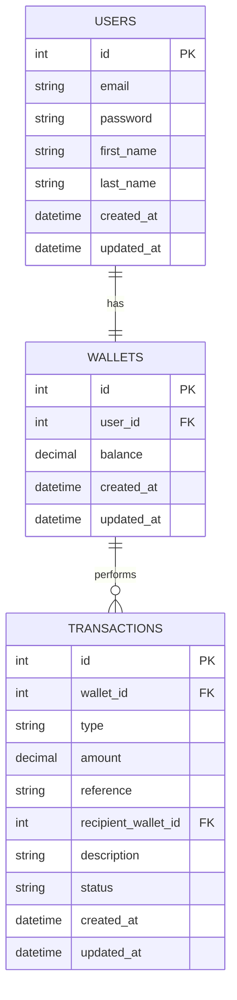

# Lendsqr Demo Credit Wallet Service

A specific MVP wallet service for a mobile lending app, built with Node.js, TypeScript, KnexJS, and MySQL.

## Features

- **User Accounts**: Register and login users.
- **Karma Blacklist Check**: Integrates with Lendsqr Adjutor API to prevent onboarding blacklisted users.
- **Wallet System**: Each user gets a wallet upon registration.
- **Transactions**:
  - Fund wallet
  - Transfer funds (P2P)
  - Withdraw funds
- **Transaction History**: View all wallet transactions.

## Technology Stack

- **Runtime**: Node.js (LTS via `pnpm`)
- **Language**: TypeScript
- **Framework**: Express.js
- **Database**: MySQL 8.0
- **ORM**: KnexJS
- **Testing**: Jest & Supertest

## Setup Instructions

### Prerequisites

- Node.js (v18+)
- pnpm
- Docker Desktop (for MySQL)

### 1. Clone & Install

```bash
git clone <repository-url>
cd lendsqr-demo-credit
pnpm install
```

### 2. Database Setup

Ensure Docker is running, then start the MySQL container (if not already running):

```bash
docker run --name demo-credit-db -e MYSQL_ROOT_PASSWORD=password123 -e MYSQL_DATABASE=demo_credit -p 3306:3306 -d mysql:8
```

Create the test database manually if needed:

```sql
CREATE DATABASE demo_credit_test;
```

### 3. Environment Config

Copy `.env.example` to `.env`:

```bash
cp .env.example .env
```

Update `.env` with your Lendsqr Adjutor API Key if available.

### 4. Run Migrations

```bash
pnpm migrate
```

### 5. Start Server

**Development:**

```bash
pnpm dev
```

**Production:**

```bash
pnpm build
pnpm start
```

## Testing

Run unit and integration tests:

```bash
pnpm test
```

## API Documentation

| Method | Endpoint                    | Description               | Auth Required |
| ------ | --------------------------- | ------------------------- | ------------- |
| POST   | `/api/auth/register`        | Register new user         | No            |
| POST   | `/api/auth/login`           | Login user                | No            |
| GET    | `/api/users/me`             | Get user profile & wallet | Yes           |
| GET    | `/api/wallets/balance`      | Get wallet balance        | Yes           |
| POST   | `/api/wallets/fund`         | Fund wallet               | Yes           |
| POST   | `/api/wallets/transfer`     | Transfer funds            | Yes           |
| POST   | `/api/wallets/withdraw`     | Withdraw funds            | Yes           |
| GET    | `/api/wallets/transactions` | Get transaction history   | Yes           |

## E-R Diagram


